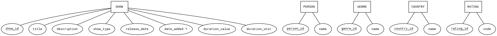
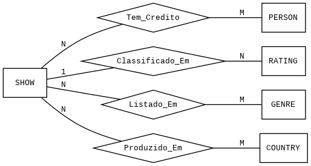

# DisneyPlusDB

Relational database and Flask web app to explore the Disney+ catalogue (movies & TV shows).
Databases course project, 2nd year of the BSc in AI & Data Science (FCUP), graded **20/20**.

## Overview
- **Data:** [Disney Movies and TV Shows](https://www.kaggle.com/datasets/shivamb/disney-movies-and-tv-shows) (Kaggle)
- **Modelling:** ER model normalised into 8 tables: `Show`, `Person`, `Credit`, `Genre`, `Country`, `Rating`, `Show_Genre`, `Show_Country`
- **ETL:** Python script that cleans the raw data (multi-valued cast, director, genre and country fields) and populates a SQLite database
- **Web app:** Flask + Jinja templates to browse the catalogue by show, person, genre, country, rating and year
- **Analytical SQL queries**, e.g. top actors and directors, longest movies, top exporting countries, average duration per genre, people who both act and direct, monthly and weekday release patterns, cumulative catalogue growth, genres by rating

## ER model



## Run locally
```bash
cd app
pip install flask
python3 server.py   # http://localhost:9000
```
The repository already includes the populated database (`app/DisneyDB.db`). To rebuild it, see `app/schema.sql` and `app/populate_db.py`.

## Tech
Python · SQLite · SQL · Flask · Jinja2 · HTML/CSS

## Team
Xavier Teixeira ([@xaviert15](https://github.com/xaviert15)) · David Pereira ([@davidampereira](https://github.com/davidampereira)) · Afonso Santos ([@afonsosantos06](https://github.com/afonsosantos06))
